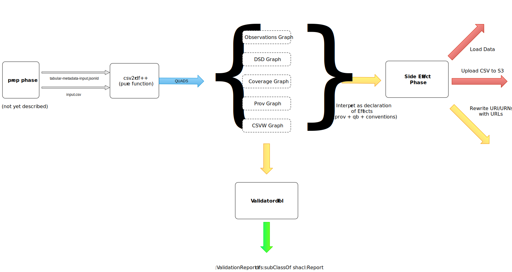

# CSVW Table2QB Design Notes

Notes from a design & architecture discussion between @RicSwirrl and
@RickMoynihan `[2018-01-24 Wed]`.  Written up by @RickMoynihan.

The ideas are probably not fundamentally different from Robins work.
This document is intended to help align perspectives and facilitate
discussion.

## Scope

These notes are concerned primarily with the Table2QB phase, though
touch on other aspects, e.g. a prep phase, and dataset/vocab creation.
It is assumed that these phases have occured as pre-requisites.

## Outline

This design is intended to operate under the following constraints:

1. Make as much of the process as possible pure and free of side effects.
2. Leave the responsibility of naming `csvw:Table` inputs to a side
   effecting step at the end.
3. Be testable by providing useful inspection points.
4. Provide several different wrapping applications around a pure core
   for use in different contexts.  e.g. a command line tool for
   running transformations, and validating output; along with a HTTP
   service tool.

## High Level Design



The diagram above describes at a high level the processes involved
that should be applicable within all the different contexts.

The contexts described later, show how the bulk of this high level
process can be materialised across several different environments:

- A purely local command line environment (e.g. onsite at ONS)
- A publismydata environment (featuring draftsets/pipelines/etc)
- A hypothetical user using the opensource tools with their own "side
  effector"

We envision that `table2qb` is a pure (and reusable) function that
takes as input two "values" as arguments the `input.csv` file as a
sequence of a rows and the `tabuar-metadata.jsonld` as a EDN map/tree.
Both of these inputs are provided by the prep phase.  This function
emits a sequence of quads, which depending on the "application
wrapper" will be materialised into a trig/nquads file, a draftset, and
possibly also a SPARQL update endpoint.

The wrapping applications should support several modes which can
selectively be turned on and combined at will.  These are currently
`:observation`, `:dsd` & `:coverage`.  When a mode is enabled triples
of that classification will be output into a graph identified by a
corresponding URN, e.g. `<urn:swirrl:table2b:observation>` or
`<urn:swirrl:table2b:dsd>`.  These graphs can then be used to easily
filter out groups of data for either debugging, validation or
operational purposes.

Additionally we believe it is important to propogate state and capture
the user intention / operation throughout the wider process.  We
therefore propose using `prov-o` to represent simultaneously:

- the operations that have occured, 
- the current state of the transformation/workflow and
- improve the capture/publication of the provinance and transformation
  of data as additional metadata which may also be published.

@Robsteranium mentioned on slack that CSVW/table2rdf has similar
provisions for using `prov` in standard mode, so we may wish to
consider aligning these perspectives.  Though @RicSwirrl and I
discussed

Here we assume the [prep phase](#prep-phase) has already happened.  

## Wrapping Applications

We envision implementing several different wrapping applications, that
wrap the core `table2qb` function and expose its core functionality to
support different environments, usecases and contexts.

In addition to the applications, we also envision a component
currently called the "Side Effector" who's job is to apply the
declarations made by the pipeline process to the world.  Such tasks
include:

- Loading triples materialised in the previous steps into the database
- Uploading the `input.csv` (and probably its accompanying
  `tabular-metadata.jsonld`) to a place on the web where it can later
  be published.

This process is necessarily bespoke to Swirrl/PMD, as it will require
configuration & credentials for web services we use such as S3,
drafter, and knowledge of the protocols involved.

The set of functions included in the Side Effectors will likely be
published in a `table2qb-app-helper` project.

## Command Line Wrapper

The command line wrapper (name `qb-tool.jar` is placeholder) will be
usable like so (open to bike shedding command line interface):

```
$ qb-tool.jar help

QB Tool Help:

   # Transform a `tabular-metadata.jsonld` to a set of RDF graphs 
   
   transform tabular-metadata from <web|pmd|filesystem> <source-tabular-metadata.jsonld> to <pmd|filesystem> <destination> [options]

   # Load RDF from a prior transform run with the supplied loader

   load tabular-metadata from <pmd|filesystem> <source> to <pmd|filesystem> <destination> [options]
   
   # Validate the transformed RDF output

   validate from <pmd|filesystem> <source> to <pmd|filestem> <report-destination>

```

### qb-tool transform 


```
$ qb-tool.jar append :all input.csv tabular-metadata.jsonld output.trig
```

### PMD / HTTP Wrapper

